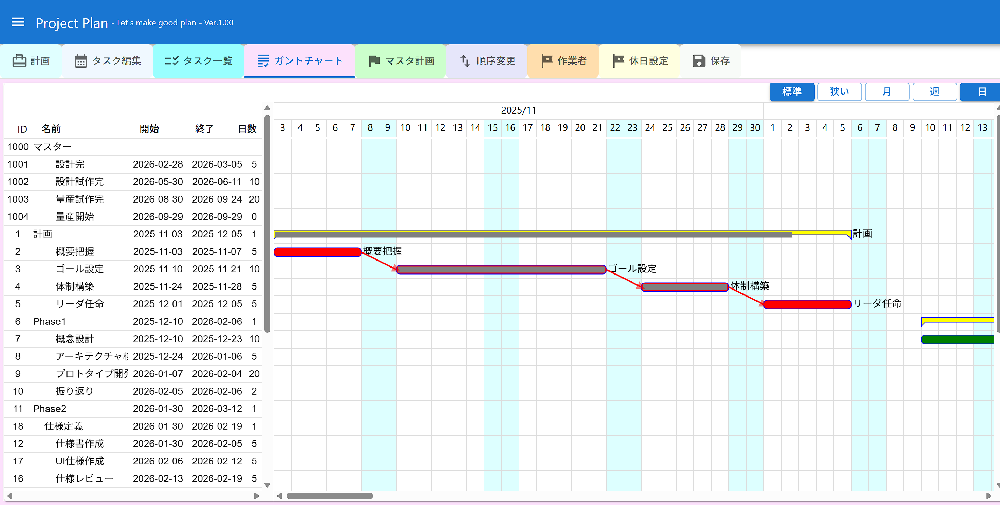

# ProjectPlan

## 概要
- 工程表を作成するアプリ

## 機能
- タスクを登録し、ガントチャートを表示する
- 作業者を設定でき、作業者ごとにガントチャートの色を変更できる
- 休日を設定でき、タスクの日数を設定すると、休日を除いて期間を設定する
- タスクは前のタスク、後ろのタスクと連結してスケジュール設定できる
- マスターの工程表を設定して、マスター工程表のマイルストンと連携できる
- CSVファイルのエクスポートとインポートに対応した
- ガントチャートの圧縮表示モードを搭載した

## 設計
- 基本的にはTravelPlanの派生
- FrontendはReact+TypeScriptで実装している
  - UIライブラリははMaterialUIを利用している
  - ガントチャート部分は既存のコンポーネントを使わず、独自実装している
- BackendはPHPの独自フレームワークで実装している
  - ファイルの読み書きのみ実施し、機能はほとんどFrontendで実装している

## 詳細
- [マニュアル](./doc/manual.md)

