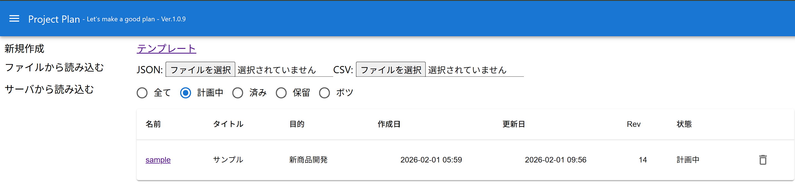
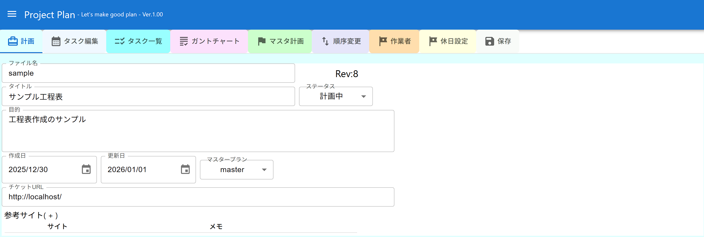
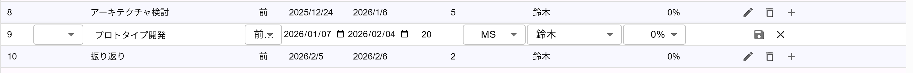
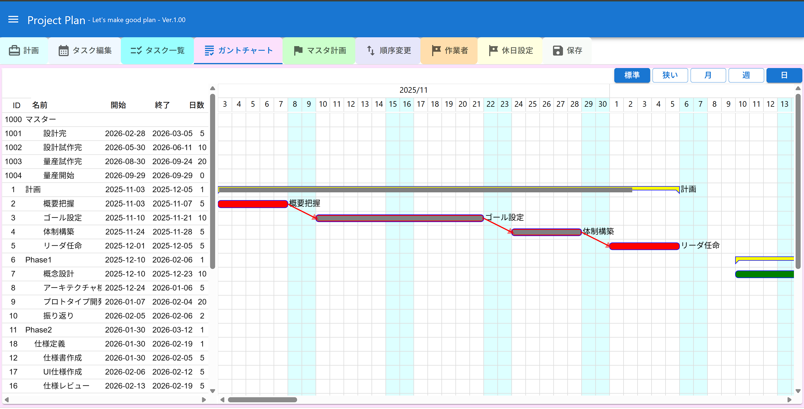
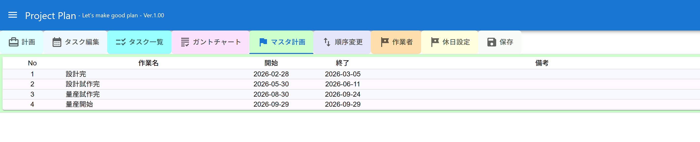
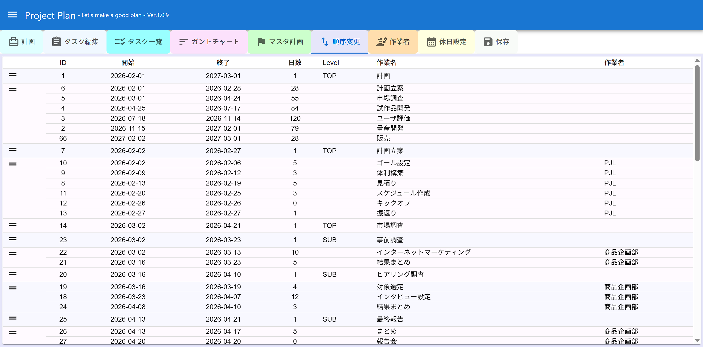
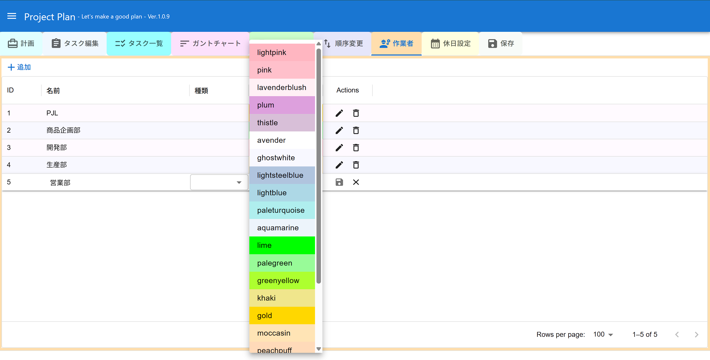
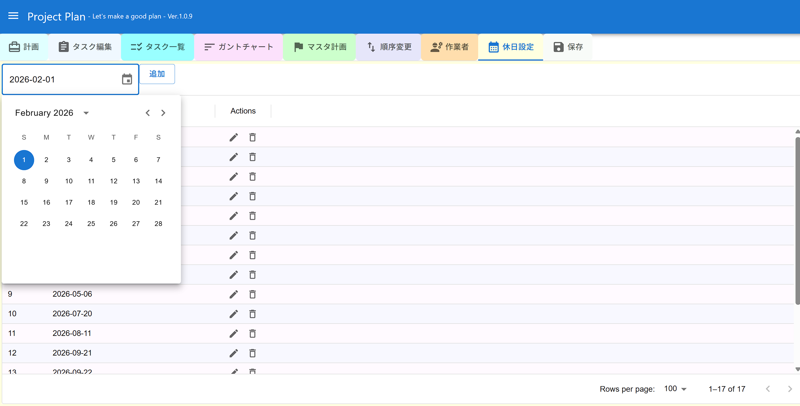
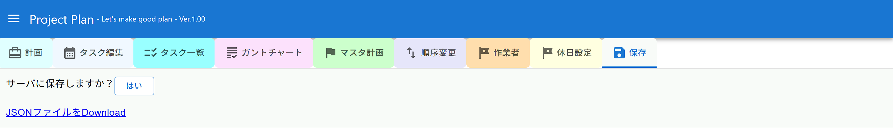

# ProjectPlan
## 概要
- 工程表を作成するアプリ

## 機能
- タスクを登録し、ガントチャートを表示できる
- 作業者を設定でき、作業者ごとにガントチャートの色を変更できる
- 休日を設定でき、タスクの日数を設定すると、休日を除いて期間を設定する
- タスクは前のタスク、後ろのタスクと連結してスケジュール設定できる
- マスターの工程表を設定して、マスター工程表のマイルストンと連携できる

## 実行環境
- 開発では以下のバージョンを利用している
  - php-8.0.29
  - node.js 22.16.0

## インストール
### URL
- frontendのパスは、以下のようなパスを想定する
    ```
    http://my.hoge.net/projectplan/
    ```
- backendのパスは、以下のようなパスを想定する
    ```
    http://my.hoge.net/projectplan/backend/
    ```

### ダウンロードと展開
- GitHubからコードをzipなどでダウンロードする
- ダウンロードしたファイルを展開する。以降の例では、以下のディレクトリに展開したものとして説明する
    ```
    /home/hoge/projectplan/
    ```
### Backend
- composerでパッケージをインストーする
    ```
    $ cd backend
    $ composer updateg
    ```
- .envを編集し、Frontendのパスを記載する
    ```
    FRONTEND_URL=http://my.hoge.net/projectplan/
    ```

### Frontend
- npmrでパッケージをインストーする
    ```
    $ cd frontend
    $ npm i
    ```
- .env.productionを編集する
    ```
    REACT_APP_SERVER_URL="http://my.hoge.net/projectplan/backend/index.php"
    REACT_APP_BASEPATH='/projectplan/'
    ```
- buildする
    ```
    $ npm run build
    ```
- buildディレクトリをコピーする
    ```
    $ mkdir ../public
    $ cp -r build/* ../public
    ```

### Apacheの設定
- conf.d/projectplan.confなどを作成する
- backend/publicフォルダにAliasを設定する。
    ```
    Alias /projectplan/backend/ "/home/hoge/projectplan/backend/public"
    <Directory "/home/hoge/projectplan/backend/public">
        Require all granted
    </Directory>
    ```

- publicフォルダにAliasを設定する。
    ```
    Alias /projectplan/ "/home/hoge/projectplan/public"
    <Directory "/home/hoge/projectplan/public">
        Require all granted
    </Directory>
    ```
- apacheの変更を有効にする
    ```
    # apachectl greceful
    ```

## 操作説明

### プロジェクト選択

- 新規作成する場合はテンプレートをクリックする
- 保存済みファイルはリストから選択する
  - ステータスにより分類されリストされる
- ファイルの削除する場合は削除アイコンをクリックする

### 計画画面

- 基本情報を設定する
- ファイル名
  - 保存するファイル名。変更すると別名で保存される
- マスター
  - 他のプロジェクトファイルをマスター計画に指定する
  - 指定されたファイルのタイプにMS（MileStone）指定されたタスクのみ読み込まれリンクできる
- チケットURL
  - チケットへのリンクを生成するベースとなるURLを指定する

### タスク編集

- タスクの編集画面で、編集したい行をダブルクリックすると編集モードになる
- 各項目の詳細は編集モーダルの説明を参照


- 保存アイコン（FDのアイコン）をクリックすると、編集モードを終了する
- ENTERキーでも編集モードを終了する


- 編集アイコン（ペンのアイコン）をクリックすると、編集モーダルが表示される
- レベル
  - TOP（大項目）、SUB（中項目）、なしを指定する
  - TOPとSUBは開始日、終了日、日数が指定できず、配下のタスクの開始日と終了日が自動的に設定される
- 作業名
  - タスクの名前
- 開始日
  - タスクの開始日
- 終了日
  - タスクの終了日（連結で通常か固定の場合のみ指定可能）
- 日数
  - タスクの終了日（連結で固定以外の場合に指定可能）
- 連結
  - 通常：開始日と日数でタスクの期間を指定する
  - 固定：開始日と終了日でタスクの期間を指定する
  - 前：前タスクの次の日が開始日で、そのから日数で期間を指定する
  - 後：後タスクの前の日が終了日で、そこから日数で期間を指定する
- 作業者
  - 作業者を指定する
- チケット番号
  - チケット番号を指定する
  - タスク一覧でチケットへのリンクが表示される
- 進捗
  - 進捗を10%単位で指定する
- マスター
  - マスター計画のマイルストンから関連するマイルストンを指定する
  - ガントチャートでマスター計画のマイルストンにリンク線が引かれる
- タイプ
  - なし：日数計算は休日を除外して計算する
  - MS：マスター計画に指定された場合にマイルストン
  - 休日稼働：日数計算は休日も含めて計算する
- リンクタイプ
  - このタスクから、リンクIDで指定したタスクへリンク線を引く
  - リンク線のタイプを指定する
    - s2s：開始日→開始日にリンク線を引く
    - s2e：開始日→終了日にリンク線を引く
    - e2s：終了日→開始日にリンク線を引く
    - e2e：終了日→終了日にリンク線を引く
- リンクID
  - リンク先のタスクIDを指定する
- 備考
  - 補足説明など

### タスク一覧

- タスク定義の情報を一覧表示する
- 編集アイコン（ペンのアイコン）をクリックすると、編集モーダルも表示され編集できる

### ガントチャート

- ガントチャートを表示する
- 最初のマスター計画のマイルストンが表示され、以降に定義したタスクが表示される
- テーブル部をクリックするとタスク編集モーダルが表示される
- 月、週、日は表示単位を切り替えるボタン
- 標準、狭いは列の幅を指定する

### マスターマイルストン

- マスター計画のマイルストンタスクを表示する

### 順序変更

- ドラッグ＆ドロップでタスクの順序を入れ替えられる
- 連結されたタスクはまとめて移動できる

### 作業者

- 作業者を登録する
- 背景色はガントチャートのバーの色を指定する

### 休日設定

- 休日を設定する
- 日付指定でタスクの期間を指定する場合、休日は除外されて日数計算される

### 保存

- 保存するとサーバにデータが保存される
- 編集中に他のユーザーが変更したら、保存できない
  - その場合はファイル名を変更して保存するなどする
